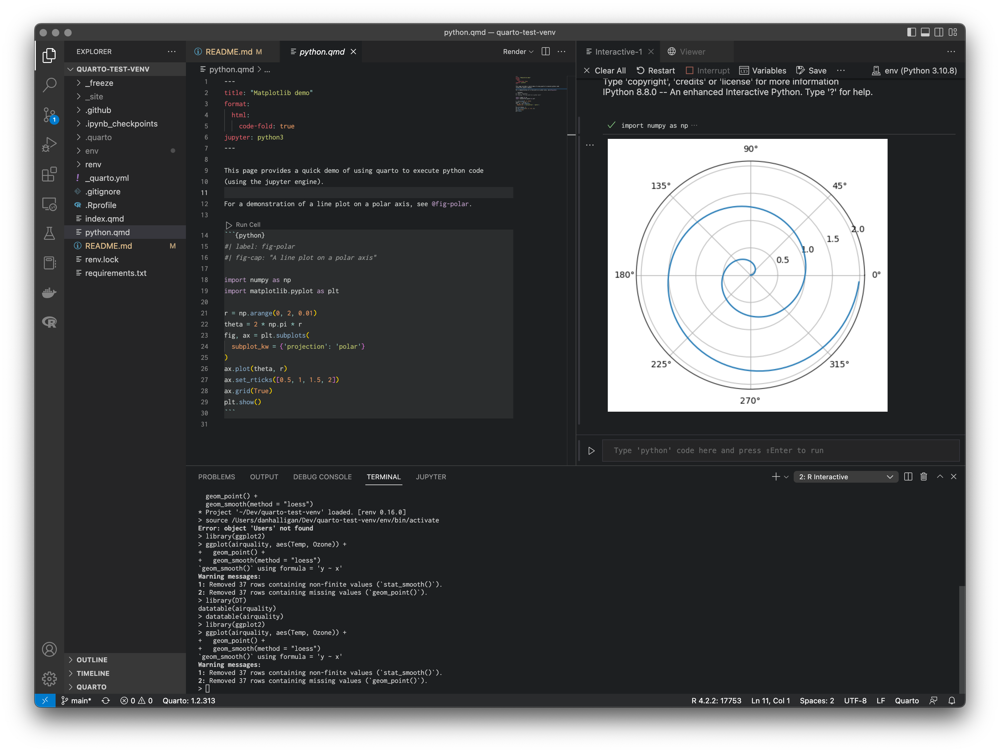

# quarto-test-venv

Testing quarto for reporting with R / python. The intention here is to explore an option for
delivering rapid ad hoc analyses via the web in a reproduible and simple way.

This repo demonstrates:
* using [venv](https://packaging.python.org/en/latest/guides/installing-using-pip-and-virtual-environments/#creating-a-virtual-environment) 
 and [renv](https://rstudio.github.io/renv/articles/renv.html) to build a reproducible environment for analysis in R and python. 
* using [quarto](https://quarto.org/) for literate programming and reporting
* using [github-pages](https://pages.github.com/) for hosting of built report
* using [github workflows](https://docs.github.com/en/actions/using-workflows) to automatically
  publish via CI/CD.

The intention is to work towards a self contained reproducible template for performing and 
reporting ad hoc analyses.

Analyses are performed within a docker container (with R / jupyter installed), and output
is stored in `_freeze`. The site can then be publish easily, either outside of the container
locally (with `quarto publish gh-pages`) or automatically via the CI pipeline in 
`.github/workflows`.

More sophisticated hosting could be explored if e.g. database backends are required to display information.

## Setup

For details see the [Virtual Enivronments](https://quarto.org/docs/projects/virtual-environments.html) section of the quarto docs.

### Install quarto

<https://quarto.org/docs/get-started/>

### Setup virtual environments

To setup python environment (`venv`):

```shell
python3 -m venv env
source env/bin/activate
python3 -m pip install jupyter matplotlib
python3 -m pip freeze > requirements.txt
```

To setup R environment (`renv`):

```R
install.packages("renv")
renv::init()
```

Then restart R session and install required pacakges

```R
renv::install(c("shiny", "jsonlite", "ggplot2", "htmltools", "remotes", "knitr", "rmarkdown", "quarto", "DT"))
```

## Reproducing environment

1. Clone the repo
2. Restore venv:

```shell
python3 -m venv env
source env/bin/activate
python3 -m pip install -r requirements.txt
```

2. Restore renv:

```R
renv::restore()
```

## Running

* Run `quarto render` to build the site.
* Run `quarto preview` to build the site and preview locally
* Run `quarto publish gh-pages` to publish to github pages (you need to run once locally).



## Links:

* https://www.r-bloggers.com/2022/07/how-to-set-up-quarto-with-docker-part-1-static-content/
* https://quarto.org/docs/projects/virtual-environments.html
* https://github.com/quarto-dev/quarto-actions/tree/main/publish
